# Phomemo-tools

This package is trying to provide tools to print pictures using
the Phomemo M02, M110, M120, M220 and T02 thermal printers from Linux.

All the information here has been reverse-engineered sniffing
the bluetooth packets emitted by the Android application.

python3-pybluez and phomemo-tools CUPS driver can be found at
[phomemo-tools RPM](http://vivier.eu/phomemo-tools/)

## License

This project is licensed under the GNU General Public License v3.

Some image assets are provided under a separate license.
See images/LICENSE for details.

## 1. Usage

### 1.1. Bluetooth

* connection

```
$ bluetoothctl devices
Device DC:0D:30:90:23:C7 Mr.in_M02
$ bluetoothctl pair DC:0D:30:90:23:C7
Attempting to pair with DC:0D:30:90:23:C7
[CHG] Device DC:0D:30:90:23:C7 Connected: yes
[CHG] Device DC:0D:30:90:23:C7 Bonded: yes
[CHG] Device DC:0D:30:90:23:C7 ServicesResolved: yes
[CHG] Device DC:0D:30:90:23:C7 Paired: yes
Pairing successful
$ sudo rfcomm connect 0 DC:0D:30:90:23:C7
  Connected /dev/rfcomm0 to DC:0D:30:90:23:C7 on channel 1
  Press CTRL-C for hangup
```

* Send the picture to the printer (the python script currently only works with M02 printers):

```
  tools/phomemo-filter.py my_picture.png > /dev/rfcomm0
```

### 1.2. USB

* Plug the USB printer cable

* Check the printer is present:

```
  $ lsusb
  ...
  Bus 003 Device 013: ID 0493:b002 MAG Technology Co., Ltd
  ...
```

You can see the serial port in the dmesg and in /dev:

```
  $ dmesg
  ...
  usb 3-3.7.2: new full-speed USB device number 13 using xhci_hcd
  usb 3-3.7.2: New USB device found, idVendor=0493, idProduct=b002, bcdDevice= 3.00
  usb 3-3.7.2: New USB device strings: Mfr=1, Product=2, SerialNumber=3
  usb 3-3.7.2: Product: USB Virtual COM
  usb 3-3.7.2: Manufacturer: Nuvoton
  usb 3-3.7.2: SerialNumber: A02014090305
  cdc_acm 3-3.7.2:1.0: ttyACM0: USB ACM device
  usblp 3-3.7.2:1.2: usblp0: USB Bidirectional printer dev 13 if 2 alt 0 proto 2 vid 0x0493 pid 0xB002
  $ ls -lrt /dev
  ...
  drwxr-xr-x.  2 root    root         100 Dec  5 17:44 usb
  crw-rw----.  1 root    dialout 166,   0 Dec  5 17:44 ttyACM0
  ...
  $ ls -lrt /dev/usb
  total 0
  crw-------. 1 root root 180, 96 Dec  5 16:46 hiddev0
  crw-------. 1 root root 180, 97 Dec  5 16:46 hiddev1
  crw-rw----. 1 root lp   180,  0 Dec  5 17:44 lp0
```

* Send the picture to the printer (the python script currently only works with M02 printers):

You need to be root or in the lp group

```
  # tools/phomemo-filter.py my_picture.png > /dev/usb/lp0
```

## 2. CUPS

### 2.1. Installation

On Fedora, the `phomemo-tools` RPM is available from COPR:

```
  $ sudo dnf copr enable lvivier/phomemo-tools
  $ sudo dnf install phomemo-tools
```

On Debian you have to install cups:

```
  $ sudo apt-get update
  $ sudo apt-get install cups
```

Next you need to ensure the required dependencies are installed (if this is skipped you will see a 'Filter Failure' error when trying to print):

```
  $ sudo apt-get install python3-pil python3-pyusb
```

Finally once you are in the folder containing your copy of this repository you can build and install phomemo-tools files:

```
  $ cd cups
  $ make
  $ sudo make install
```

### 2.2. Configuration

#### 2.2.1. GUI

##### 2.2.2.1.1. Pre-requisite

To connect using USB, you need python3-pyusb.
For instance, on Fedora:

```
   $ sudo dnf install python3-pyusb
```

On Fedora, SELinux seems to prevent the backend to create a bluetooth socket.
If you have such error message in your syslog:

```
localhost.localdomain cupsd[2659]: Can\'t open Bluetooth connection: [Errno 13] Permission denied
```

You might need to disable SELinux enforcement to allow the backend to run correctly:

```
  $ sudo semanage permissive -a cupsd_t
```

I didn't find a way to define correctly the SELinux rules to allow the backend
to use bluetooth socket without to change the enforcement mode
(the couple ausearch/audit2allow doesn't fix the problem).

##### 2.2.2.1.1. Pair the printer

1. Switch on the printer
2. Open the "Settings" window:


3. Select the "Bluetooth" Panel:


4. Select your bluetooth printer (here "Mr.in_M02"):


5. Your printer must be paired but not connected ("Disconnected"):


6. Select the "Printers" Panel:


You'll probably need to unlock it to be able to add a new printer.

Click on "Add a Printer...".

8. Select your printer and click on "Add":


9. Your printer will appear in the printers list:


10. Click on the settings menu of the printer and select "Printing Options":


11. Select "Media Size Label 50mmx70mm" and click on "Test Page":


12. Check the result:


#### 2.2.2. CLI

##### 2.2.2.1. Bluetooth

This definition will use the "phomemo" backend to connect to the printer:

###### 2.2.2.1.1 M02

```
  $ sudo lpadmin -p M02 -E -v phomemo://DC0D309023C7 \
                           -P /usr/share/cups/model/Phomemo/Phomemo-M02.ppd.gz
```

###### 2.2.2.1.2 M110, M120, M220

Use ”Phomemo-M110.ppd.gz”. This driver is compatible with M110, M120, and M220.
The -p option defines the printer name. It should be changed according to the printer used.

```
  $ sudo lpadmin -p M110 -E -v phomemo://DC0D309023C7 \
                           -P /usr/share/cups/model/Phomemo/Phomemo-M110.ppd.gz
```

##### 2.2.2.2. USB

This definition will use the /dev/usb/lp0 device to connect to the printer:

###### 2.2.2.2.1 M02

```
  $ sudo lpadmin -p M02 -E -v serial:/dev/usb/lp0 \
                           -P /usr/share/cups/model/Phomemo/Phomemo-M02.ppd.gz
```

###### 2.2.2.1.2 M110, M120, M220

Use ”Phomemo-M110.ppd.gz”. This driver is compatible with M110, M120, and M220.
The -p option defines the printer name. It should be changed according to the printer used.

```
  $ sudo lpadmin -p M110 -E -v serial:/dev/usb/lp0 \
                           -P /usr/share/cups/model/Phomemo/Phomemo-M110.ppd.gz
```

##### 2.2.2.3. Check printer options

You can use the following command to check the options for your printer which will list the printer defaults with a "*":

```
  $ lpoptions -d M02 -l
```

##### 2.2.2.4. Printing

You can use the following command to print text using CUPS:

```
  $ echo "This is test"  | lp -d M02 -o media=w50h60 -
```

You can use the following command to print an image using CUPS:

```
  $ lp -d M02 -o media=w50h60 my_picture.png
```

The M110, M120 & M220 printers have support for LabelWithGaps, Continuous and LabelWithMarks media types which can be specified as follows:

```
  $ echo "This is test"  | lp -d M110 -o media=w30h20 -o MediaType=Continuous
```

## 3. Image samples to use with the printer

They are AI generated.

They may be used, copied, modified, and redistributed freely, including for commercial purposes.

They are not claimed to be public domain and are not licensed under the GPL.

They do not have a human author in the sense of copyright law.

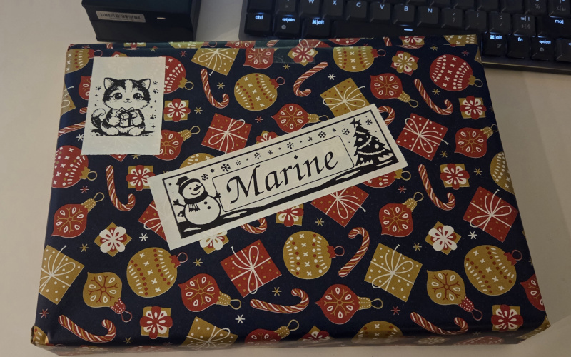

### 3.1. Animals

|                 |  | 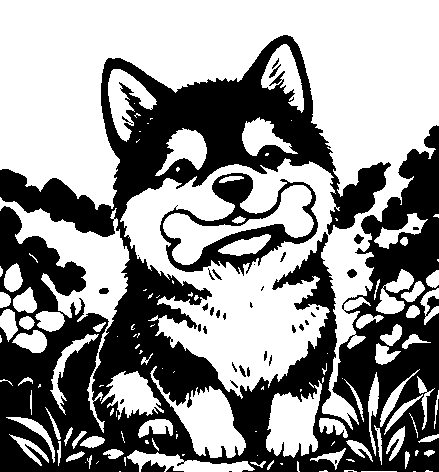                     |
| --------------------------------------------------------------------------------- | ----------------------------------------------------------------------------------------- | ----------------------------------------------------------------------------------------- |
|      |                  |              |
| 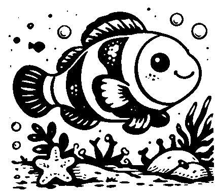 | 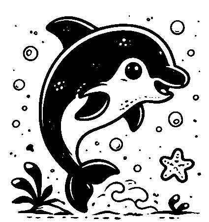             |  |
| 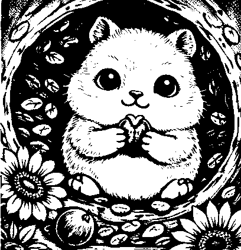     |            | 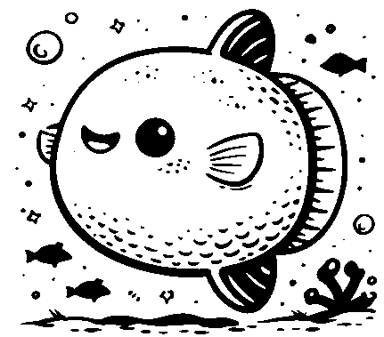           |
|      |              |                |
|  |                  | 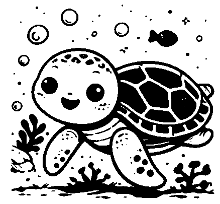           |

### 3.2. Astronomy

|  |            |  |  |
| ----------------------------------------------------------------------------------- | ----------------------------------------------------------------------------------- | --------------------------------------------------------------------------------------- | ----------------------------------------------------------------------------- |
|        | 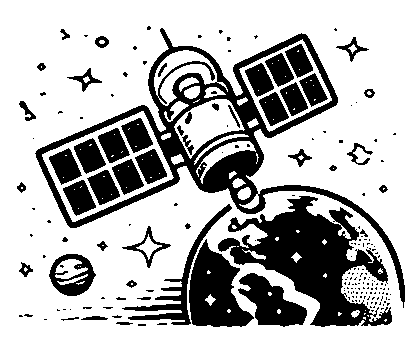 |      |        |

### 3.3. Birthday


|  |  |
| ---------------------------------------------------------------------------------- | ---------------------------------------------------------------------------------- |
|  |  |

### 3.4. Christmas

|  |  | 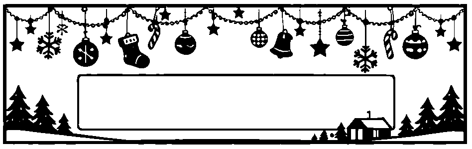 |
| ------------------------------------------------------------------------------------- | ------------------------------------------------------------------------------------- | ------------------------------------------------------------------------------------- |

| 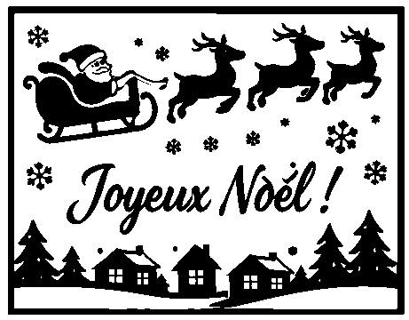 | 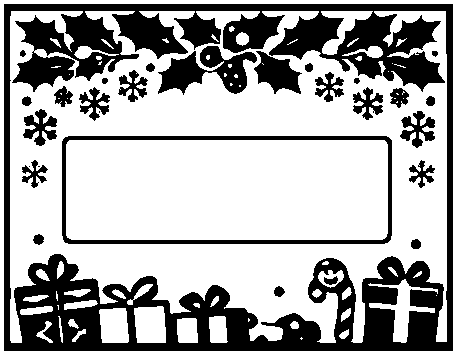 |
| ------------------------------------------------------------------------------------- | ------------------------------------------------------------------------------------- |

### 3.5. Everyday

|        |  |                    |
| -------------------------------------------------------------------------------------------- | -------------------------------------------------------------------------------------------- | ---------------------------------------------------------------------------------------------- |
|  |                |              |
| 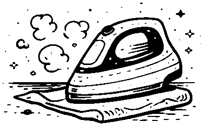                     |                      |                |
|    |          | 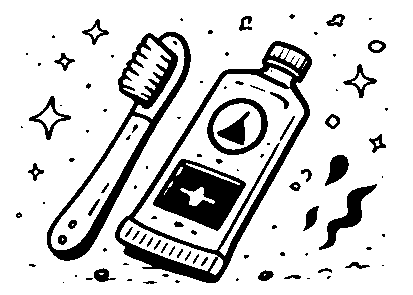           |
|                  |  |  |

### 3.6. Flowers


|  |            |  |
| ------------------------------------------------------------------------- | --------------------------------------------------------------------------------- | --------------------------------------------------------------------------------------------------- |
|    |  |                            |

### 3.7. Landscape

|        | 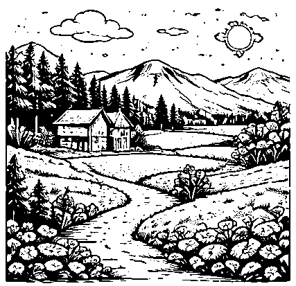 | 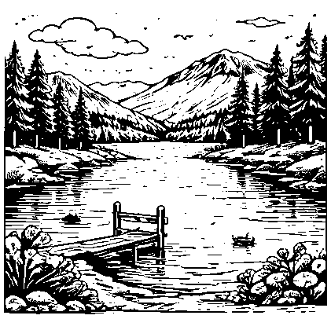 |
| --------------------------------------------------------------------------------- | --------------------------------------------------------------------------------------- | --------------------------------------------------------------------------------- |
| 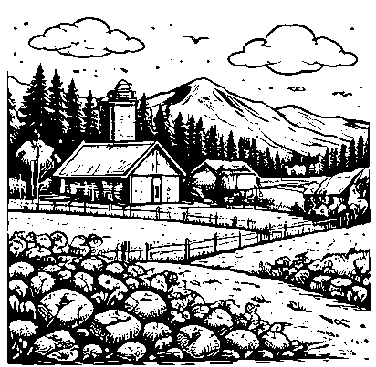 | 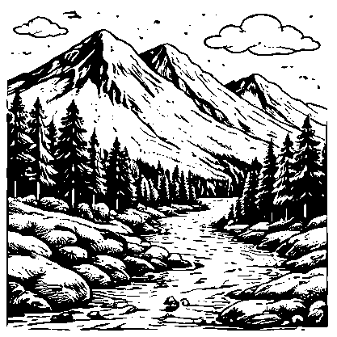             | 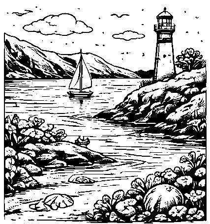 |

### 3.8. Objects

|  | 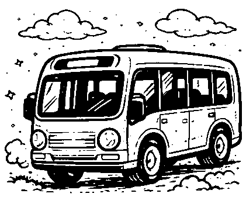         | 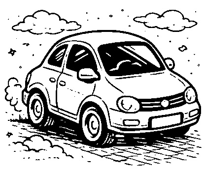     |
| ------------------------------------------------------------------------------- | ----------------------------------------------------------------------------- | ------------------------------------------------------------------------- |
|      |  |  |

### 3.9. People

| 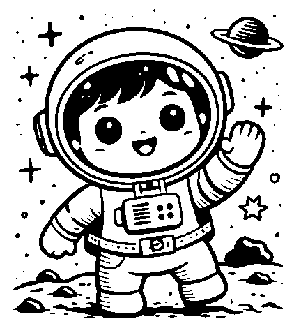 |        |      |
| -------------------------------------------------------------------------------- | ------------------------------------------------------------------------------ | ---------------------------------------------------------------------------------- |
| 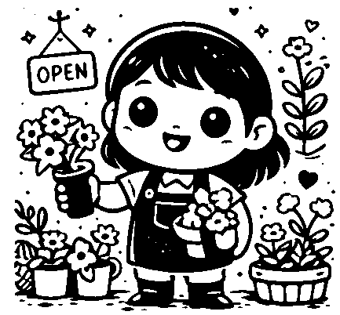     | 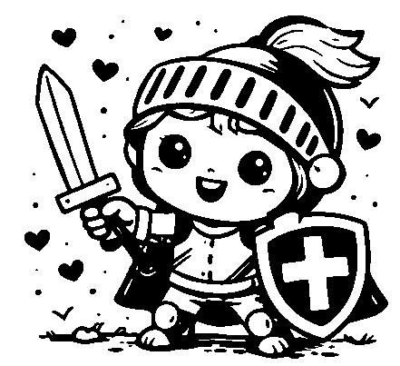     | 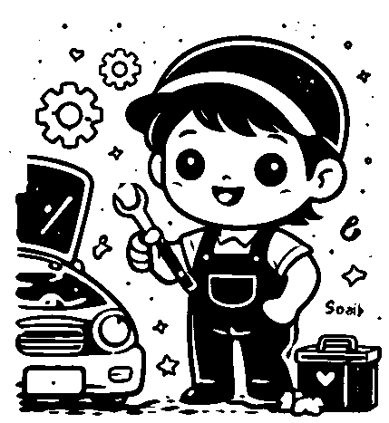     |
|        |  | 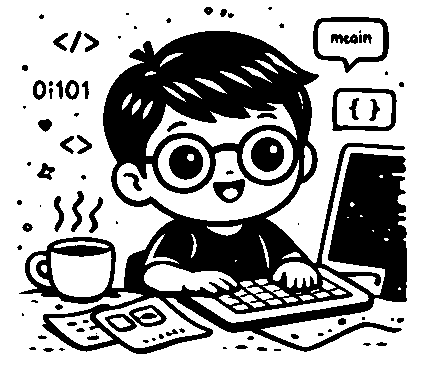 |
|          |        |                                                                                    |

### 3.10. Pictograms

|  |  |          |    |  |
| ------------------------------------------------------------------------ | ------------------------------------------------------------------------------------ | ---------------------------------------------------------------------------------- | ---------------------------------------------------------------------------- | ------------------------------------------------------------------------------ |
|  |      |  | 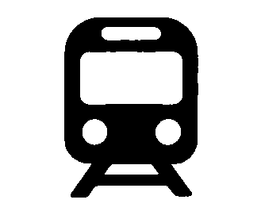 |      |

### 3.11. School-Office

| 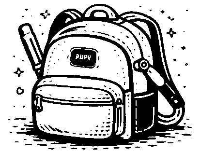   |          |            |
| --------------------------------------------------------------------------------------- | --------------------------------------------------------------------------------------- | ----------------------------------------------------------------------------------------------- |
|  |  |        |
|        |    |  |

### 3.12. To Do

|  |  |  |  |
| ---------------------------------------------------------------------- | ---------------------------------------------------------------------- | ---------------------------------------------------------------------- | ---------------------------------------------------------------------- |

### 3.13. Tools

|  |  |  |  |
| ----------------------------------------------------------------------- | --------------------------------------------------------------------------------------- | ----------------------------------------------------------------------------- | ------------------------------------------------------------------- |

### 3.14 Frames


| 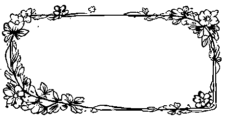 |  |
| --------------------------------------- | --------------------------------------- |
| 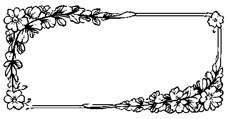 | 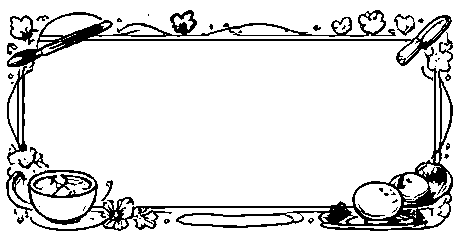 |
|  | 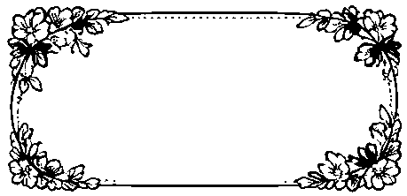 |

|    | 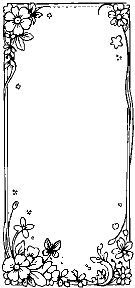   | 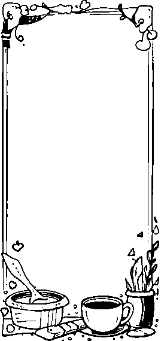 |
| ----------------------------------------- | ----------------------------------------- | ----------------------------------------- |
| 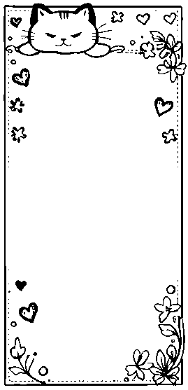 | 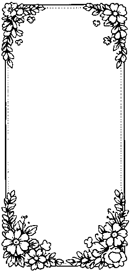 | 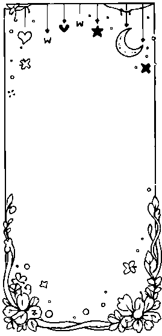 |

# 4. Protocol for M02

After dumpping bluetooth packets, it appears to be EPSON ESC/POS Commands.

### 4.1. HEADER

```
  0x1b 0x40      -> command ESC @: initialize printer
  0x1b 0x61      -> command ESC a: select justification
  0x01           range: 0 (left-justification), 1 centered,
                        2 (right justification)
  0x1f 0x11 0x02 0x04
```

### 4.2. BLOCK MARKER

```
  0x1d 0x76 0x30 -> command GS v 0 : print raster bit image
  0x00              mode: 0 (normal), 1 (double width),
                          2 (double-height), 3 (quadruple)
  0x30 0x00         16bit, little-endian: number of bytes / line (48)
  0xff 0x00         16bit, little-endian: number of lines in the image (255)
```

  Values seem to be 16bit little-endian

  If the picture is not finished, a new block marker must be sent with
  the remaining number of line (max is 255).

### 4.3. FOOTER

```
  0x1b 0x64      -> command ESC d : print and feed n lines
  0x02           number of line to feed
  0x1b 0x64      -> command ESC d : print and feed n lines
  0x02           number of line to feed
  0x1f 0x11 0x08
  0x1f 0x11 0x0e
  0x1f 0x11 0x07
  0x1f 0x11 0x09
```

### 4.4. IMAGE

  Each line is 48 bytes long, each bit is a point (384 pt/line).
  size of a line is 48 mm (80 pt/cm or 203,2 dpi, as announced by Phomemo).
  ratio between height and width is 1.

### 4.5. Printer message

```
1a 04 5a
1a 09 0c
1a 07 01 00 00
1a 08
51 30 30 31 45 30 XX XX XX XX XX XX XX XX XX -> Serial Numer: E05C0XXXXXX
```

## 5. Protocol for M110/M120/M220

Dumpping USB packets.

### 5.1. HEADER

```
  0x1b 0x4e 0x0d  -> Print Speed
  0x05            range: 0x01 (Slow) -  0x05 (Fast)
  0x1b 0x4e 0x04  -> Print Density
  0x0f            range: 01 - 0f
  0x1f  0x11      -> Media Type
  0x0a            Mode: 0a="Label With Gaps" 0b="Continuas" 26="Label With Marks"
```

### 5.2. BLOCK MARKER

```
  0x1d 0x76 0x30 -> command GS v 0 : print raster bit image
  0x00              mode: 0 (normal), 1 (double width),
                          2 (double-height), 3 (quadruple)
  0x2b 0x00         16bit, little-endian: number of bytes / line (43)
  0xf0 0x00         16bit, little-endian: number of lines in the image (240)
```

### 5.3. FOOTER

```
  0x1f 0xf0 0x05 0x00
  0x1f 0xf0 0x03 0x00
```
