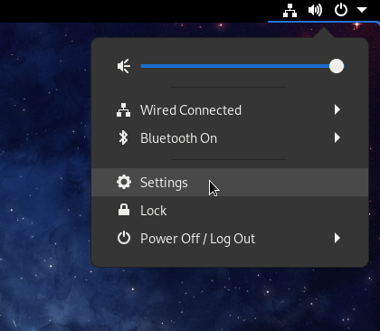
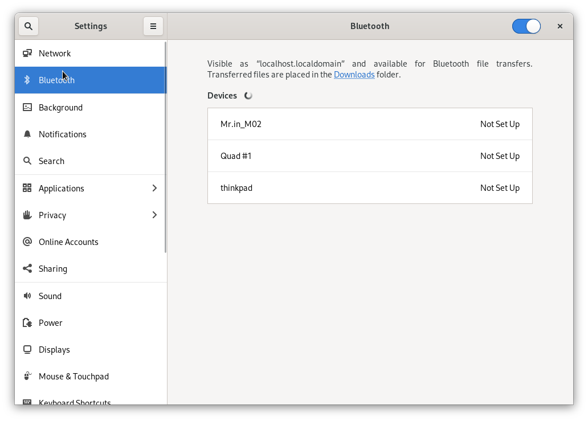
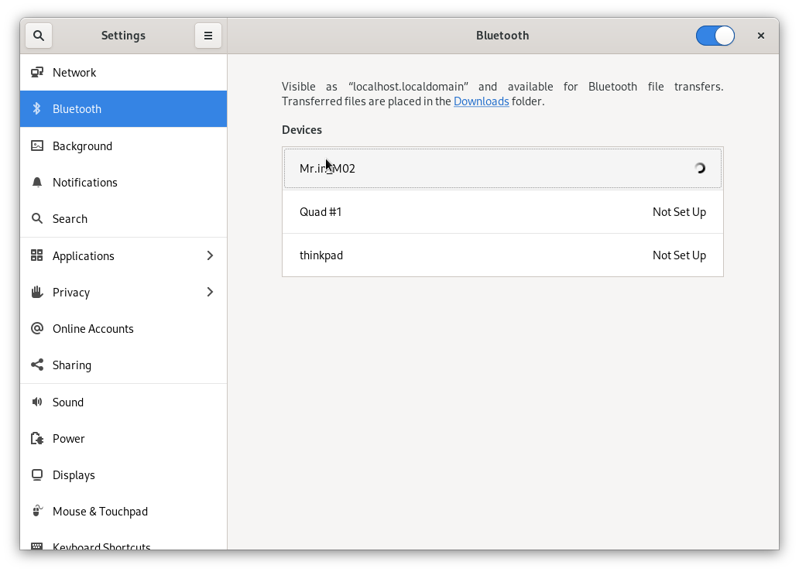
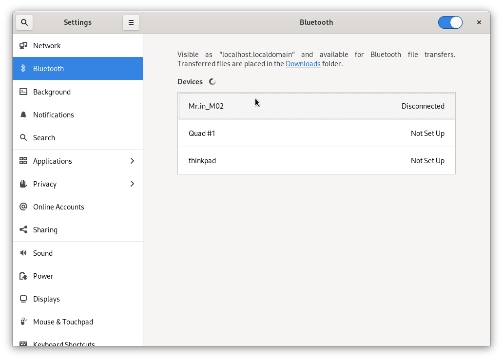
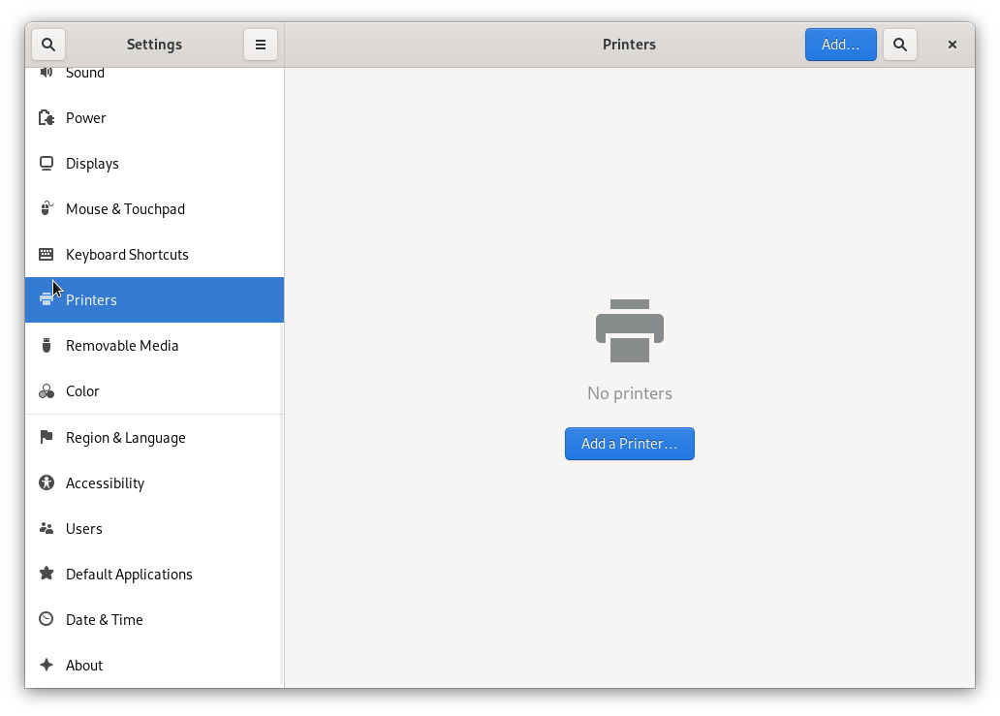
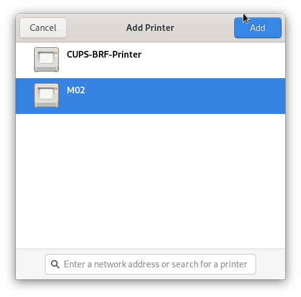
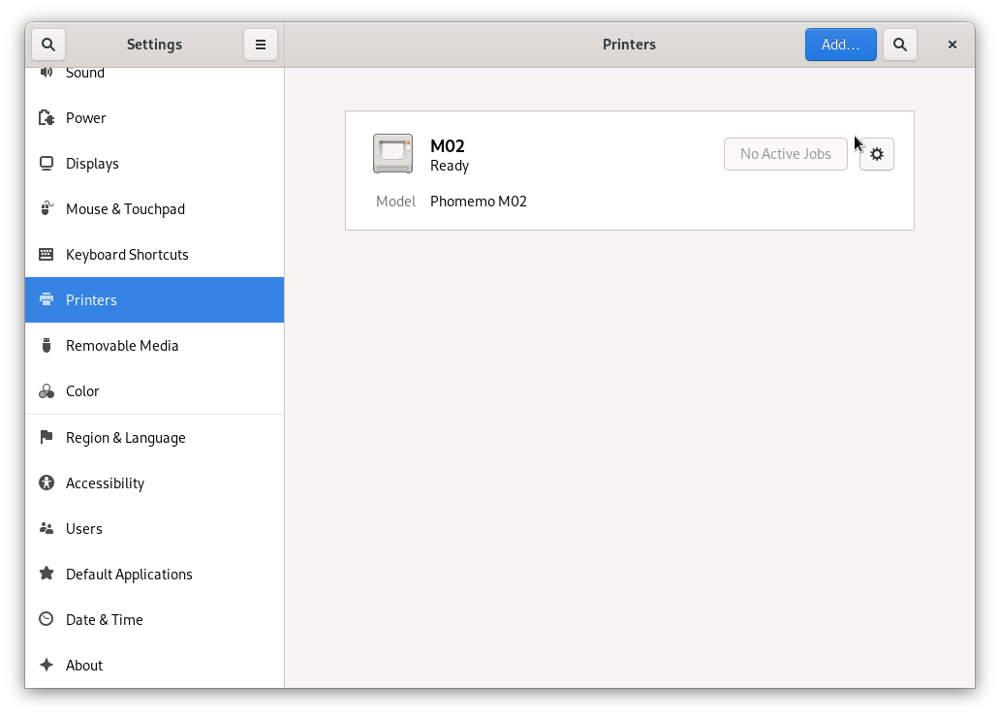
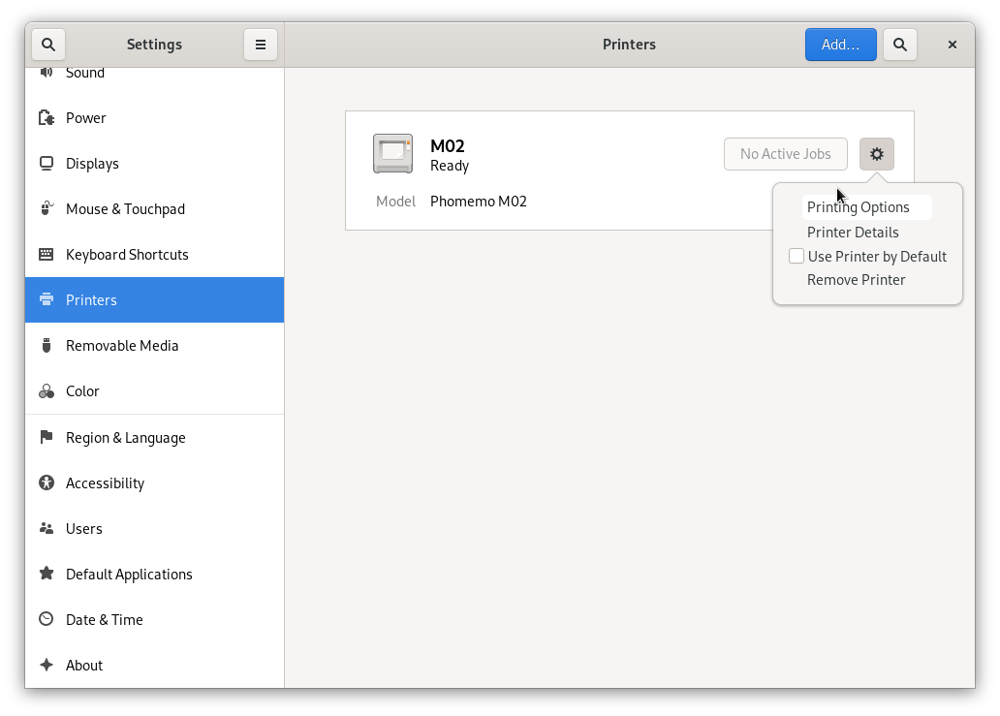
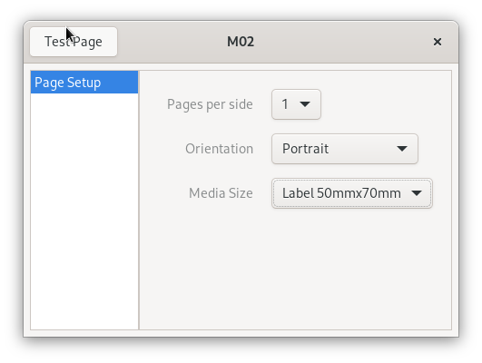

# Phomemo-tools

This package is trying to provide tools to print pictures onto
the Phomemo M02 thermal printer from Linux.

All the information here has been reverse-engineered sniffing
the bluetooth packets emitted by the Android application.

python3-pybluez and phomemo-tools CUPS driver can be found at
[phomemo-tools RPM](http://vivier.eu/phomemo-tools/)

## 1. Usage

### 1.1. Bluetooth
* connection

```
$ hcitool scan
Scanning ...
  DC:0D:30:90:23:C7	Mr.in_M02
$ sudo rfcomm connect 0 DC:0D:30:90:23:C7
  Connected /dev/rfcomm0 to DC:0D:30:90:23:C7 on channel 1
  Press CTRL-C for hangup
```
* send the picture to the printer

```
  tools/phomemo-filter.py my_picture.png > /dev/rfcomm0
```

### 1.2. USB

* Plug the USB printer cable

* check the printer is present:

```
  $ lsusb
  ...
  Bus 003 Device 013: ID 0493:b002 MAG Technology Co., Ltd 
  ...
```
You can see the serial port in the dmesg and in /dev:

```
  $ dmesg
  ...
  usb 3-3.7.2: new full-speed USB device number 13 using xhci_hcd
  usb 3-3.7.2: New USB device found, idVendor=0493, idProduct=b002, bcdDevice= 3.00
  usb 3-3.7.2: New USB device strings: Mfr=1, Product=2, SerialNumber=3
  usb 3-3.7.2: Product: USB Virtual COM
  usb 3-3.7.2: Manufacturer: Nuvoton
  usb 3-3.7.2: SerialNumber: A02014090305
  cdc_acm 3-3.7.2:1.0: ttyACM0: USB ACM device
  usblp 3-3.7.2:1.2: usblp0: USB Bidirectional printer dev 13 if 2 alt 0 proto 2 vid 0x0493 pid 0xB002
  $ ls -lrt /dev
  ...
  drwxr-xr-x.  2 root    root         100 Dec  5 17:44 usb
  crw-rw----.  1 root    dialout 166,   0 Dec  5 17:44 ttyACM0
  ...
  $ ls -lrt /dev/usb
  total 0
  crw-------. 1 root root 180, 96 Dec  5 16:46 hiddev0
  crw-------. 1 root root 180, 97 Dec  5 16:46 hiddev1
  crw-rw----. 1 root lp   180,  0 Dec  5 17:44 lp0
```

* send the picture to the printer:

You need to be root or in the lp group

```
  # tools/phomemo-filter.py my_picture.png > /dev/usb/lp0
```
## 2. CUPS

### 2.1. Installation

```
  $ cd cups
  $ make
  $ sudo make install
```

### 2.2. Configuration
#### 2.2.1. GUI
##### 2.2.2.1.1. Pre-requisite

The CUPS backend (phomemo) uses the Python pyBluez to connect to the printer, so
be sure to install the required dependencies, for instance with Fedora:

```
   $ sudo dnf install python3-devel
   $ sudo pip install pybluez
```

SELinux seems to prevent the backend to create a bluetooth socket.
If you have such error message in your syslog:

```
localhost.localdomain cupsd[2659]: Can\'t open Bluetooth connection: [Errno 13] Permission denied
```
You might need to disable SELinux enforcement to allow the backend to run correctly:

```
  $ sudo semanage permissive -a cupsd_t
```

I didn't find a way to define correctly the SELinux rules to allow the backend
to use bluetooth socket without to change the enforcement mode 
(the couple ausearch/audit2allow doesn't fix the problem).

##### 2.2.2.1.1. Pair the printer

1. Switch on the printer
2. Open the "Settings" window:



3. Select the "Bluetooth" Panel:



4. Select your bluetooth printer (here "Mr.in_M02"):



5. Your printer must be paired but not connected ("Disconnected"):



6. Select the "Printers" Panel:



You'll probably need to unlock it to be able to add a new printer.

Click on "Add a Printer...".

8. Select your printer and click on "Add":



9. Your printer will appear in the printers list:



10. Click on the settings menu of the printer and select "Printing Options":



11. Select "Media Size Label 50mmx70mm" and click on "Test Page":



12. Check the result:


#### 2.2.2. CLI
##### 2.2.2.1. Bluetooth

This definition will use the "phomemo" backend to connect to the printer:

```
  $ sudo lpadmin -p M02 -E -v phomemo://DC0D309023C7 \
                           -P /usr/share/cups/model/Phomemo/Phomemo-M02.ppd.gz
```

##### 2.2.2.2. USB

This definition will use the /dev/usb/lp0 device to connect to the printer:

```
  $ sudo lpadmin -p M02 -E -v serial:/dev/usb/lp0 \
                           -P /usr/share/cups/model/Phomemo/Phomemo-M02.ppd.gz
```

## 3. Protocol

After dumpping bluetooth packets, it appears to be EPSON ESC/POS Commands.

### 3.1. HEADER

```
  0x1b 0x40      -> command ESC @: initialize printer
  0x1b 0x61      -> command ESC a: select justification
  0x01           range: 0 (left-justification), 1 centered,
                        2 (right justification)
  0x1f 0x11 0x02 0x04           
```

### 3.2. BLOCK MARKER
```
  0x1d 0x76 0x30 -> command GS v 0 : print raster bit image
  0x00              mode: 0 (normal), 1 (double width),
                          2 (double-height), 3 (quadruple)
  0x30 0x00         16bit, little-endian: number of bytes / line (48)
  0xff 0x00         16bit, little-endian: number of lines in the image (255)
```
  
  Values seem to be 16bit little-endian

  If the picture is not finished, a new block marker must be sent with
  the remaining number of line (max is 255).

### 3.3. FOOTER
```
  0x1b 0x64      -> command ESC d : print and feed n lines
  0x02           number of line to feed
  0x1b 0x64      -> command ESC d : print and feed n lines
  0x02           number of line to feed
  0x1f 0x11 0x08
  0x1f 0x11 0x0e
  0x1f 0x11 0x07
  0x1f 0x11 0x09
```
### 3.4. IMAGE

  Each line is 48 bytes long, each bit is a point (384 pt/line).
  size of a line is 48 mm (80 pt/cm or 203,2 dpi, as announced by Phomemo).
  ratio between height and width is 1.

### 3.5. Printer message

```
1a 04 5a
1a 09 0c
1a 07 01 00 00
1a 08 
51 30 30 31 45 30 XX XX XX XX XX XX XX XX XX -> Serial Numer: E05C0XXXXXX
```

